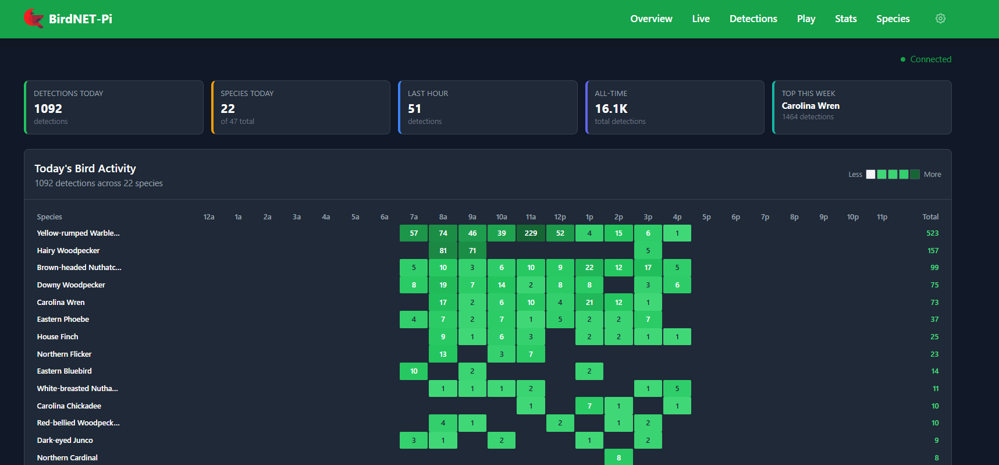

# birdnet-pi fork

a modernized fork of [Nachtzuster's BirdNET-Pi](https://github.com/Nachtzuster/BirdNET-Pi) with a new Go + Preact frontend.

the original php web interface still works at `/legacy`. the new preact app runs at `/`.



## what's different

this fork replaces the php web interface with:

- **go api server** - fast, handles websockets, runs as a systemd service with auto-restart
- **preact frontend** - modern typescript ui, real-time updates via websocket
- **same python backend** - birdnet analysis unchanged, just talks to go now

the bird detection stuff is identical to upstream. this is just a frontend/api rewrite.

## architecture

```
browser → caddy → go api (port 8080) → sqlite (read-only)
                                     → python ml service
                                     → websocket for live updates
```

## requirements

same as upstream:
- raspberry pi 5, 4b, 400, 3b+, or 0w2
- 64-bit raspios (trixie recommended)
- usb microphone or sound card

## installation

fresh install - use the upstream installer, then pull this branch:

```bash
# install base birdnet-pi first
curl -s https://raw.githubusercontent.com/Nachtzuster/BirdNET-Pi/main/newinstaller.sh | bash

# switch to this fork
cd ~/BirdNET-Pi
git remote set-url origin https://github.com/addlatt/BirdNET-Pi-fork.git
git fetch origin
git checkout cutover/go-backend
git pull

# build go server
go build -o bin/birdnet-server ./cmd/server

# build preact app
cd web && npm install && npm run build && cd ..

# install and start the go service
bash deployment/install-api-service.sh
```

## usage

access from any browser on your network:
- `http://birdnetpi.local` or your pi's ip
- new preact ui at `/`
- legacy php at `/legacy`

### service management

```bash
# check status
sudo systemctl status birdnet-api

# view logs
sudo journalctl -u birdnet-api -f

# restart
sudo systemctl restart birdnet-api
```

the go server auto-restarts if it crashes. rate limited to 5 restarts per minute to prevent loops.

## development

see [CLAUDE.md](CLAUDE.md) for the full dev guide.

quick version:

```bash
# make changes locally
# commit and push
git add -A && git commit -m "message" && git push

# on pi: pull, rebuild, restart
ssh user@birdnet "cd ~/BirdNET-Pi && git pull && go build -o bin/birdnet-server ./cmd/server && cd web && npm run build && sudo systemctl restart birdnet-api"
```

## api

main endpoints:

```
GET  /api/health              # health check
GET  /api/detections          # list detections
GET  /api/species             # species with counts
GET  /api/settings            # current config
PUT  /api/settings            # update config
GET  /api/services            # service statuses
WS   /ws                      # websocket for live updates
```

## license

same as upstream - [CC BY-NC-SA 4.0](LICENSE)

**you cannot use this for commercial products.**

## credits

- [kahst/BirdNET-Analyzer](https://github.com/kahst/BirdNET-Analyzer) - the ml model
- [mcguirepr89/BirdNET-Pi](https://github.com/mcguirepr89/BirdNET-Pi) - original project
- [Nachtzuster/BirdNET-Pi](https://github.com/Nachtzuster/BirdNET-Pi) - maintained fork this builds on
